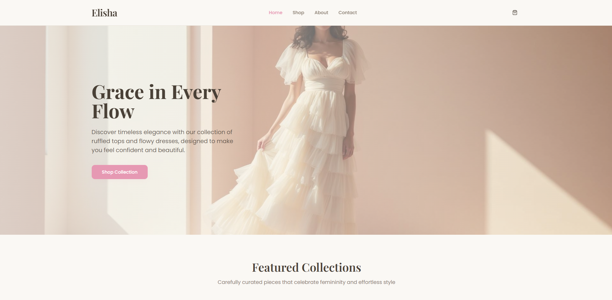

# 👗 Elisha — Grace in Every Flow

### A Women’s Clothing Store Website UI/UX Design

**Elisha** is a minimalist and elegant women’s clothing brand, offering timeless fashion pieces such as **ruffled tops** and **flowy dresses**. 

---

## 🌸 Project Overview

The **Elisha website** focuses on a seamless and aesthetic browsing experience.  
It enables users to:
- Explore featured collections
- View product details
- Add items to their cart
- Complete simple checkout transactions

---

## 🧵 Core Features

### 1. Home Page
- Hero section with logo and tagline:  
  _“Grace in Every Flow.”_
- Highlights featured collections like **The Ruffle Edit** and **The Flowy Dress Series**
- Simple navigation bar: `Home | Shop | About | Contact`

### 2. Shop Page
- Displays products with images, names, and prices  
- Filter by **category (Ruffled Tops, Flowy Dresses, Accessories)**  
- Includes search and sorting options for easy browsing  

### 3. Product Page
- High-quality product imagery with zoom feature  
- Product details: description, price, available sizes, and materials  
- “Add to Cart” and “Buy Now” buttons  
- Suggested related products  

### 4. Cart and Checkout
- Clean cart summary with total price and editable quantities  
- Simple checkout form:
  - Name  
  - Email  
  - Address  
  - Phone Number  

### 5. About Page
- Brand story highlighting **Elisha’s** roots in Manila  
- Mission:  
  _“To make every woman feel confident and effortlessly stylish through well-crafted, timeless designs. We're committed to creating pieces that you'll love to wear again and again, transcending trends and celebrating your unique beauty.”_

### 6. Contact Page
- Contact form (Name, Email, Message)  
- Links to social media pages (Instagram, Facebook, Pinterest)

---

## 🎨 Design Direction

**Aesthetic:**  
Soft, feminine, and elegant — blending minimalism with sophistication.

**Color Palette:**  
- Cream  
- Blush Pink  
- Muted Lavender  
- Warm Beige  

**Typography:**  
- Headings: *Playfair Display* / *Cormorant Garamond* (Elegant Serif)  
- Body: *Poppins* / *Lato* (Clean Sans-Serif)

**Imagery:**  
- Focus on natural lighting, soft backgrounds, and lifestyle photography.  
- Showcases women wearing **ruffled tops** and **flowy dresses** in serene, airy environments.

---
## 🧡 Credits

**Developed by:** Elisha Jhoyce Magbitang
**Design Concept:** Modern Feminine Minimalism  
**Purpose:** Website design for Women’s Clothing Brand — _Elisha: Grace in Every Flow_

---

